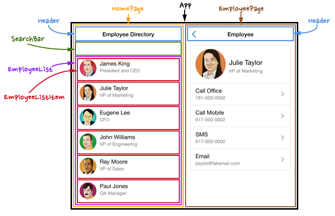

# Instructions

Create a React CodeSandbox and name it "React Page Layout Lab."
Build a page that looks like the left side of the mockup below.

You should create an App, Homepage, Header, SearchBar, EmployeeList and EmployeeListItem.
Style your components to accurately match the given layout. You do not need to include images, but can if you have time.

No functionality is needed, just arrange the layout with with React components.
Submit the link to your CodeSandbox on Canvas when you are finished.

